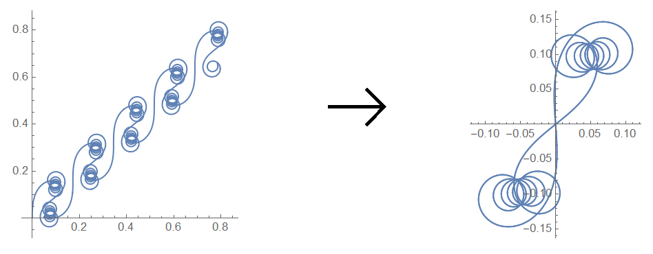
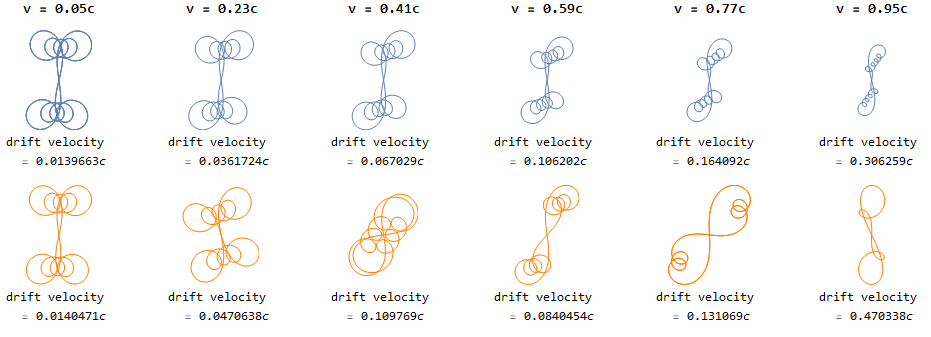
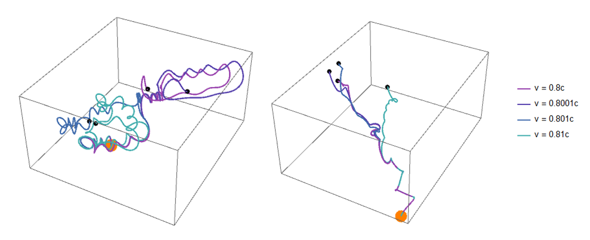

# mathematica-dynamics
A few physics simulations written in Mathematica notebooks to find the dynamics of an arbitrary n-spring system, a double pendulum, and relativistic/nonrelativistic charged particles in electromagnetic fields.
## N-spring system
The motion of a mass on a spring is modeled by Hooke's Law, which states that the spring force F = -kx, the spring constant multiplied by the displacement from equilibrium. When multiple masses are attached by springs in a chain, the spring force on every mass is influenced by the spring on its left and its right, which causes the equations of motion to be "coupled": the motion of each mass must be solved for simultaneously, as the motions of all masses are interdependent. 
The Mathematica notebook file [springdynamics.nb](springdynamics.nb) provides code that generates the set of coupled differential equations governing a series of coupled springs (springs connected in a chain), then integrates these equations to obtain the motion of each spring and animates the result:


## Double pendulum
Deriving the equations of motion of a double pendulum is a classic problem in Lagrangian mechanics, a sophomore-level physics topic, and the double pendulum is notable as an example of a chaotic system, meaning that small changes in initial conditions (the angles of the two pendulum rods) cause the resulting trajectories to differ wildly. The notebook [doublependulum.nb](doublependulum.nb) numerically integrates the coupled differential equations describing the system, and returns a manipulable plot which allows one to change the initial conditions and then animate the pendulum. Powerful equation solving tools and a simple implementation of manipulable plots are distinguishing features of the Wolfram language, and this notebook highlights those abilities very well. This animation is for one set of initial conditions:


## Relativistic and nonrelativistic particle dynamics in electromagnetic fields
Models of particle motion in electromagnetic fields are commonly used in particle physics and plasma physics, as electromagnetic (EM) fields are the most useful tool for trapping or accelerating charged particles.<sup id="a1">[1](#f1)</sup> At low particle velocities, the equations governing the trajectory of a charged particle in an EM field can be solved using standard methods from Newtonian physics, but at extreme speeds, those close to the speed of light _c_, the effects of Albert Einstein's theory of relativity warp particle trajectories in ways that cannot be explained by Newtonian physics. 

Nonrelativistic (Newtonian) models still have their place in modern physics in low-velocity cases, as they greatly simplify calculations, but at higher velocities, the more complex relativistic models are necessary for accurate calculations. In this project, numerical solvers in Mathematica were used to study the trajectories of charged particles in electromagnetic wave systems, and comparisons between nonrelativistic and relativistic predictions were made.

This notebook gives a detailed analysis of many different EM field scenarios, but some of the highlights are below:
### Drift motion algorithm
The trajectory of a particle in a transverse electromagnetic wave (projected onto the x-z plane) is shown in [chargedparticledynamics.nb](chargedparticledynamics.nb) in a manipulable plot allowing one to adjust parameters such as electric/magnetic field strength, particle mass, initial particle velocity, and others. The particle motion is the sum of a linear drift component and a periodic component. An efficient algorithm to isolate the periodic component of the motion was written; it detects patterns in the roots of the derivative of _x(t)_, and uses them to solve for and then eliminate the drift component of the motion. A graphical representation of its purpose is as follows:



These periodic plots provide better intuition as to how the particles accelerate in a transverse EM wave, and below, they're used to contrast nonrelativistic motion (top) with relativistic motion (bottom). This plot makes obvious how the nonrelativistic treatment is similar to the relativistic one at low fractions of the speed of light _c_, but it becomes more and more inaccurate as the velocity approaches _c_.

A taste of scripting in Mathematica (the function `comparisons[ ]` was written by me, all other syntax is native to the Wolfram language):

```Mathematica
Grid[Transpose[
  Table[Join[{Style["v = " <> ToString[v] <> "c", FontSize -> 14, 
      FontWeight -> Bold]},
    comparisons[0.1, 1.4, 0.013, 1, v, ImageSize -> Tiny, 
     Axes -> None, ImagePadding -> 0.5]],
   {v, 0.05, 0.95, 0.9/5}]],
 Spacings -> {2, 1}, Alignment -> {Center, Bottom}]
 ```



### Sensitivity to initial conditions
The trajectory of a particle in a transverse EM wave and in a circularly polarized EM wave are periodic and therefore predictable; however, published simulations of the trajectory of a particle in two perpendicular (crossed) transverse EM waves reported the motion to be chaotic.<sup id="a2">[2](#f2)</sup> In this project, I repeated simulations of both crossed transverse and circularly polarized EM waves, and both showed extreme sensitivity to initial conditions, confirming the literature result. 3D trajectory plots for several particles, identical besides their slightly different initial velocities, can be seen below (transverse waves at left, circularly polarized at right). 



The code snippet below generates the left of the two plots (`doubleplanewavemotion` is a set of differential equations written by me, and everything else is part of the Wolfram language). This highlights the ability of the Wolfram language to generate complex plots with short, very dense code, due among other things to built in iterators (`Table[ ]` and various replacement and mapping operators (`/.`, `->`, and `@`)

```Mathematica
Tmax = 18;
dmvmtrchaos =
  Table[NDSolveValue[
    Join[doubleplanewavemotion /. {m0 -> 0.1, q -> 1.4, E0 -> 0.021, 
       B0 -> 0.9},
     {x[0] == 0, y[0] == 0, z[0] == 0, x'[0] == 0, y'[0] == 0, 
      z'[0] == 0.8 + i}],
    {x, y, z}, {t, 0, Tmax}, 
    MaxSteps -> Infinity], {i, {0, 0.0001, 0.001, 0.01}}];

Show[
 Graphics3D[{Orange, PointSize -> .05, Point[{0, 0, 0}],
   PointSize -> Large, Black, 
   Table[Point[Through@dmvmtrchaos[[i]][Tmax]], {i, 1, 4}]}],
 ParametricPlot3D[
  Evaluate[Table[Through@dmvmtrchaos[[i]][t], {i, 1, 4}]], {t, 0, 
   Tmax},
  PlotRange -> All, PlotPoints -> 400, 
  PlotStyle -> Table[Hue[0.9 - i/10., 0.62, 0.68], {i, 1, 4}],
  PlotLegends -> 
   Table["v = " <> ToString[0.8 + i] <> 
     "c", {i, {0, 0.0001, 0.001, 0.01}}]]]
```

The Wolfram language is a powerful tool for computations requiring powerful differential equation solver methods such as the three above. As a multi-paradigm language, coding in the Wolfram language requires a very flexible understanding of the fundamentals of programming, making this project excellent for the mathematically-oriented amateur.

### References

<b id="f1">1. </b>“Chapter 1.” Introduction to Plasma Dynamics, by A. I. Morozov, Taylor & Francis, 2013, pp. 1–20. [↩](#a1)

<b id="f2">2. </b>Krlín, L., et al. “Role of Finite Larmor Radius in Chaotic Regime of Waves-Particle Interaction.” Czechoslovak Journal of Physics, vol. 54, no. 7, 2004, pp. 759–774., doi:10.1023/b:cjop.0000038529.45640.10. [↩](#a2)
